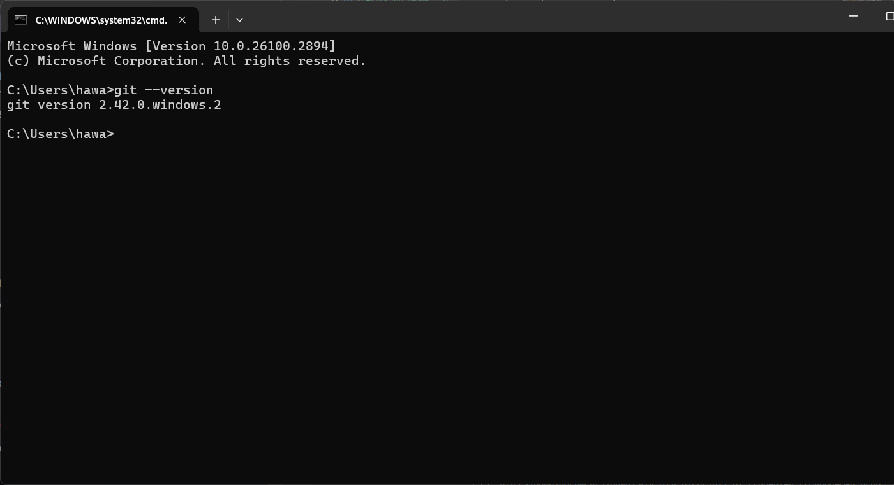
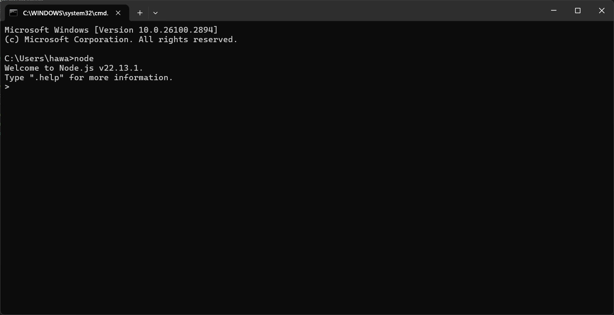
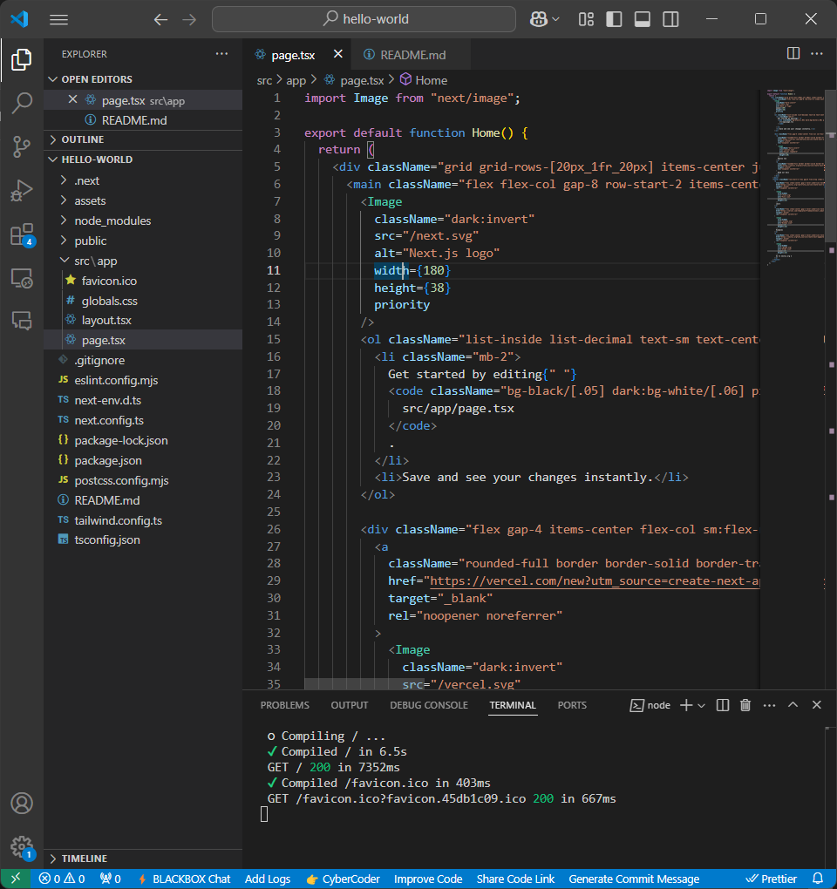

This is a [Next.js](https://nextjs.org) project bootstrapped with [`create-next-app`](https://nextjs.org/docs/app/api-reference/cli/create-next-app).

## Getting Started

First, run the development server:

```bash
npm run dev
# or
yarn dev
# or
pnpm dev
# or
bun dev
```

Open [http://localhost:3000](http://localhost:3000) with your browser to see the result.

You can start editing the page by modifying `app/page.tsx`. The page auto-updates as you edit the file.

This project uses [`next/font`](https://nextjs.org/docs/app/building-your-application/optimizing/fonts) to automatically optimize and load [Geist](https://vercel.com/font), a new font family for Vercel.

## Learn More

To learn more about Next.js, take a look at the following resources:

- [Next.js Documentation](https://nextjs.org/docs) - learn about Next.js features and API.
- [Learn Next.js](https://nextjs.org/learn) - an interactive Next.js tutorial.

You can check out [the Next.js GitHub repository](https://github.com/vercel/next.js) - your feedback and contributions are welcome!

## Deploy on Vercel

The easiest way to deploy your Next.js app is to use the [Vercel Platform](https://vercel.com/new?utm_medium=default-template&filter=next.js&utm_source=create-next-app&utm_campaign=create-next-app-readme) from the creators of Next.js.

Check out our [Next.js deployment documentation](https://nextjs.org/docs/app/building-your-application/deploying) for more details.

| | Pemrograman Berbasis Framework 2025 |
| --- | --- |
| NIM | 2241720079 |
| Nama | Hawa Esanda |
| Kelas | TI - 3E |

### Pertanyaan Praktikum 1
1. Jelaskan kegunaan masing-masing dari Git, VS Code dan NodeJS yang telah Anda install pada sesi praktikum ini!
Jawab : 
Git digunakan untuk menyimpan riwayat perubahan kode dan membantu dalam menggabungkan pekerjaan tim tanpa kirim file secara manual
VS Code digunakan sebagai text editor yang memungkinkan untuk menulis kode dengan banyak fitur seperti auto-suggest code, debugging, dan integrasi langsung dengan git.
NodeJS digunakan sebagai mesin yang menjalankan JavaScript diluar browser.

2. Buktikan dengan screenshoot yang menunjukkan bahwa masing-masing tools tersebut telah berhasil terinstall di perangkat Anda!




### Pertanyaan Praktikum 2
1. Pada Langkah ke-2, setelah membuat proyek baru menggunakan Next.js, terdapat beberapa istilah yang muncul. Jelaskan istilah tersebut, TypeScript, ESLint, Tailwind CSS, App Router, Import alias, App router, dan Turbopack!
Jawab :
- TypeScript adalah bahasa pemrograman yang mempunyai tipe data lebih ketat dibandingkan JavaScript dan bersifat open source.
- ESLint adalah alat analisis kode statis yang digunakan untuk mengidentifikasi dan memperbaiki masalah pada kode JavaScript. 
- Tailwind CSS merupakan framework CSS untuk membuat frontend situs web yang modern dan responsif.
- App Router digunakan untuk mengatur navigasi halaman 
- Import alias untuk membuat jalur impor yang lebih pendek dan lebih deskriptif.
- Turbopack adalah bundler yang meningkatkan kecepatan pengembangan aplikasi Next.js. 

2. Apa saja kegunaan folder dan file yang ada pada struktur proyek React yang tampil pada gambar pada tahap percobaan ke-3!
Jawab :
- .next merupakan folder yang dibuat otomatis oleh NextJs untuk menyimpan hasil build dan cache proyek
- node_module berisi semua library yang di install dengan npm install
- public berisi aset statis yang bia langsung diakses melalui URL seperti /image, /favicon.ico.
- src\app berisi kode utama aplikasi.

3. Buktikan dengan screenshoot yang menunjukkan bahwa tahapan percobaan di atas telah berhasil Anda lakukan!



